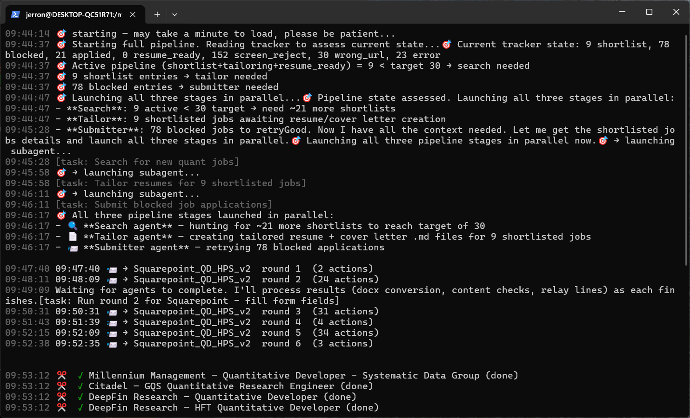

# Job Autopilot — Claude Agent Edition

AI-powered job search, resume tailoring, and application pipeline built on the [Claude Agent SDK](https://github.com/anthropics/claude-agent-sdk).

**It doesn't just apply to jobs — it understands you first.** A full loop from reading your resume pool to extract your real profile, through finding matching roles, rewriting each application, submitting forms, and handling the messy middle (logins, email verification codes, cascading dropdowns, captchas). Not a demo — runs end-to-end.

Three specialized subagents coordinated by an orchestrator:

| Agent             | What it does                                                                                                                                                                                                                                                                                                |
| ----------------- | ----------------------------------------------------------------------------------------------------------------------------------------------------------------------------------------------------------------------------------------------------------------------------------------------------------- |
| **job-search**    | Reads your resume pool to build a candidate profile (skills, titles, seniority, industries). Uses that profile to drive keyword selection and filtering, then searches LinkedIn, Indeed, Glassdoor, ZipRecruiter, and company career pages. Writes results to a tracker.                                    |
| **resume-tailor** | Reads your resume pool to extract every bullet, metric, and tool name as raw material. Fetches each shortlisted job description, rewrites bullets to match, and produces tailored `.docx` resume + cover letter — 100% based on your real experience, nothing invented.                                     |
| **job-submitter** | Opens each application form, fills fields, uploads the tailored resume and cover letter, and submits. Handles login walls autonomously: checks saved credentials, tries Forgot Password (fetches reset link from your webmail), or creates a new account — falling back to a human pause only for CAPTCHAs. |



## Requirements

- Python 3.11+
- Node.js (for Playwright MCP browser automation)
- Auth: [Claude CLI](https://claude.ai/code) (already logged in), or an [Anthropic API key](https://console.anthropic.com/)

## Setup

```bash
git clone https://github.com/jerronl/jobautopilot-claude
cd jobautopilot-claude
./setup.sh
```

`setup.sh` will ask for your personal info, then install dependencies and Playwright browsers.

## Resume pool

After setup, put your resume files in the directory you configured (default: `~/Documents/jobs/`):

```
~/Documents/jobs/
├── Resume_2026.docx    # master resume — full history, even items normally cut
├── skills.md           # certifications, tools, side projects, publications
└── bio.txt             # optional personal statement for cover letters
```

**Both the search and tailor agents read this pool first**, before doing anything else. The search agent builds a candidate profile from it — extracting your skills, past titles, industries, and seniority signals — and uses that profile to select keywords, set filters, and skip roles where you clearly don't meet hard requirements. The tailor agent then reads every bullet point and metric as raw material for rewriting, ensuring nothing is invented.

## Usage

```bash
source ~/.jobautopilot/config.sh

# Run individual stages (browser window shown by default)
jobautopilot "Search for quant developer jobs in New York"
jobautopilot "Tailor resumes for shortlisted jobs"
jobautopilot "Submit all resume_ready applications"

# Check your inbox and update tracker automatically
jobautopilot "Check my email for anything job-related I need to handle"

# Or let the orchestrator decide
jobautopilot "Run the full pipeline"

# Hide the browser window
jobautopilot --headless "Run the full pipeline"
```

The orchestrator runs all three stages concurrently — search, tailor, and submit overlap as a conveyor belt. Real-time progress appears inline in the terminal, including which company and round the submitter is on.

### Email triage

The orchestrator can also scan your inbox through the submitter's already-signed-in browser (no Gmail MCP / OAuth needed — it reuses the Playwright session that already handles verification codes). It opens every job-related message, reads the body (not just the subject line), and splits findings into **action needed** (OA deadlines, interview invites, draft reminders) vs. informational (confirmations, surveys). When it finds a rejection, interview invite, or OA notification, it updates the corresponding tracker row automatically — `denied` for employer rejections (distinct from `screen_reject` / `user_reject`, which are your own filters), `interviewing` when a scheduling link arrives, `offer` for offers.

## Self-updating knowledge base

Agents don't re-discover the same ATS quirks on every run. The `knowledge/` tree persists what the pipeline learns:

```
knowledge/
├── sites/                   # per-company quirks (keyed by parent company, not hostname)
│   ├── stripe.md            # "Location is a react-select autocomplete — type then click [role='option']"
│   ├── two_sigma.md         # canonical answer to "years of experience" question
│   └── ...
└── skills/
    ├── ats_playbooks/       # verified click/upload/multiselect recipes per ATS
    │   ├── workday.md       # hierarchical source multiselect, 7-step SPA
    │   ├── oracle_hcm.md    # .cx-select-pill-section native-click requirement
    │   ├── ashby.md         # agent-authored, no human involvement
    │   └── _selectors.md    # cross-ATS CSS/evaluate pitfalls
    └── dropdowns/            # canonical → variant-list mappings
        ├── degrees.md        # "MS" / "M.S." / "Master of Science" / "MSc" / ...
        ├── countries.md      # "United States" / "USA" / "United States (+1)" / ...
        └── eeoc.md, majors.md, schools.md
```

**Agents read these files before round 2** of any submission, and **append new variants, quirks, and recipes they discover** during a once-per-job review pass. Each run's knowledge compounds into the next.

## Hardening that came from real failures

- **Email OTP modals** (Built-in, some Workday variants): the runner surfaces `page.has_email_verification`, the submitter routes it to `fetch_email_code` with a broad Gmail search query, and fills the code — no human in the loop.
- **reCAPTCHA v3 false-positives**: the invisible badge does not block submission. The submitter re-probes after every Submit click and checks both the confirmation phrase AND that the form fields are gone before accepting "applied" — and refuses to blame reCAPTCHA without that double-check.
- **OTP regex tightened to 5–8 digits**: a 4-digit year like "2026" in an unrelated email was being picked up as a verification code.
- **URL-only login detection**: Workday apply pages contain the words "sign in" and "create account" in headers even when logged in — the runner now only trusts URL-path signals.
- **Read-only browser tasks reuse the authenticated session**: when you ask "check my inbox for recruiter replies", the orchestrator delegates to the submitter's already-signed-in Playwright browser instead of launching a fresh OAuth flow.

## Tracker

The job tracker lives at `~/.jobautopilot/workspace/job_application_tracker.md`.

| Status          | Meaning                                                         |
| --------------- | --------------------------------------------------------------- |
| `found`         | Discovered by search, not yet screened                          |
| `screen_reject` | Filtered out (salary, location, seniority, duplicate)           |
| `user_reject`   | Skipped after user review                                       |
| `shortlist`     | Approved, waiting for resume tailoring                          |
| `tailoring`     | Resume/cover letter in progress                                 |
| `resume_ready`  | `.docx` files ready, waiting to submit                          |
| `applied`       | Application submitted successfully                              |
| `denied`        | Employer rejected (rejection email received)                    |
| `interviewing`  | Interview stage (scheduling link or invite received)            |
| `offer`         | Offer extended                                                  |
| `blocked`       | Submitter could not complete (login wall, CAPTCHA, broken form) |
| `expired`       | Job listing no longer active                                    |
| `hold`          | Paused, revisit later                                           |
| `error`         | Something went wrong                                            |

## Reconfiguring

Re-run `./setup.sh` at any time to update your personal info or preferences. Existing tracker and resume files are not affected.

## License

MIT-0

## Support

If Job Autopilot saved you time, a coffee is always appreciated ☕

[](https://paypal.me/ZLiu308)

[paypal.me/ZLiu308](https://paypal.me/ZLiu308)
