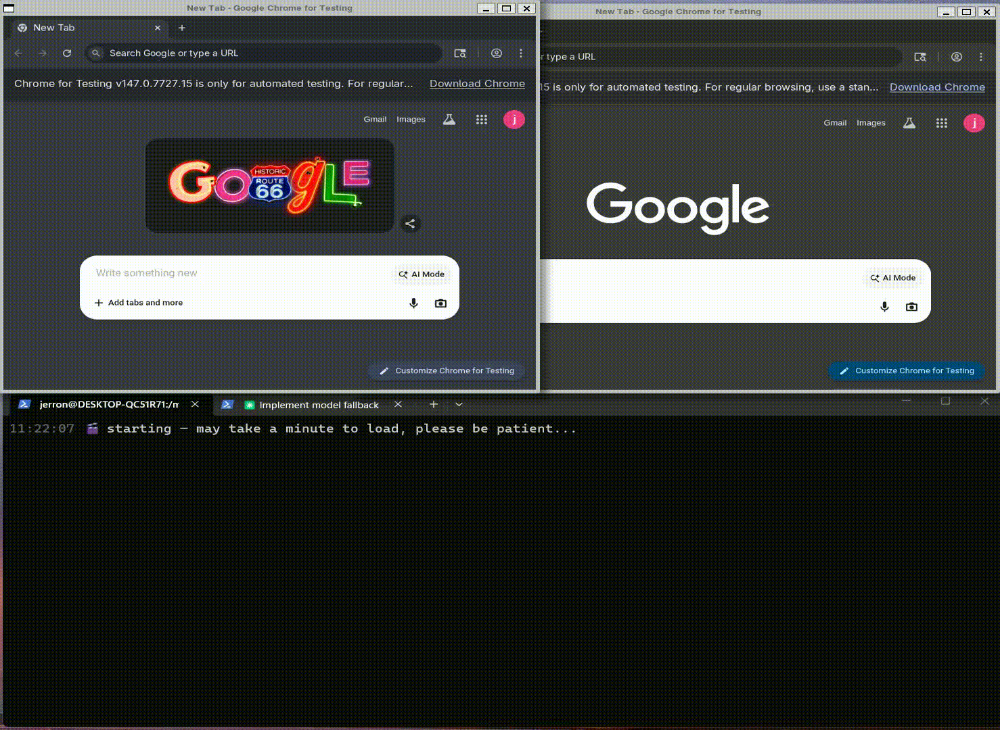

# 🚀 Job Autopilot — Claude Agent Edition

[](https://www.python.org/downloads/)
[](https://opensource.org/licenses/MIT-0)
[](https://github.com/anthropics/claude-agent-sdk)

**AI agent that runs your job search end-to-end — search, tailor, apply, and triage email**

It doesn't just blindly apply — it understands your career profile and gets smarter every time it runs.



```bash
### ⚡ Run it with a natural-language command
jobautopilot "Run the full pipeline"
```

---

## ⚡ Quick Start

```bash
git clone https://github.com/jerronl/jobautopilot-claude
cd jobautopilot-claude
./setup.sh
```

`setup.sh` will configure your environment and install Playwright browsers. Then run:

```bash
source ~/.jobautopilot/config.sh
### ⚡ Run it with a natural-language command
jobautopilot "Run the full pipeline"
```

**Requirements:**

- **Python 3.11+**
- **Node.js** (for Playwright browser automation)
- **Auth:** [Claude CLI](https://claude.ai/code) (logged in) OR an [Anthropic API key](https://console.anthropic.com/)

## 🚦 Usage

```bash
source ~/.jobautopilot/config.sh

# Run everything end-to-end (The Main Path)
jobautopilot "Run the full pipeline"

# Check your inbox, flag OA/interviews, and update tracker automatically
jobautopilot "Check my email for anything job-related I need to handle"

# Run individual stages manually
jobautopilot "Search for quant developer jobs in New York"
jobautopilot "Tailor resumes for shortlisted jobs"
jobautopilot "Submit all resume_ready applications"

# Background mode
jobautopilot --headless "Run the full pipeline"
```

---

## 📂 Resume Pool

After setup, put your resume in the configured directory (default: `~/Documents/jobs/`):

```
~/Documents/jobs/
└── Resume_2026.docx          # master resume — full history, even items normally cut
└── Resume_for_ai.docx        # tailored for your specific angle
└── Resume_for_dreaming.docx  # any tailored versions
```

The agent reads this first to build your profile for search and extracts bullet points for high-fidelity tailoring.

---

## ✨ Why This Is Not Just Another Apply Bot

1. **It understands you first.**
   It builds a candidate profile (skills, seniority, industries) to drive the **Search** stage, skipping mismatches. **Tailoring** uses your actual metrics and tool names to rewrite for specific roles. _Zero hallucinations, nothing invented._

2. **It remembers what it learns (The Compounding Advantage).**
   Every run writes back into a self-updating knowledge base.
   - _4 companies in:_ It knows Capital One's Workday tenant has an anti-bot overlay.
   - _10 companies in:_ It knows BuiltIn's autocomplete doesn't accept "Computational Finance" but accepts "Finance".
   - **The pipeline gets faster and more reliable without manual tuning.**

## ⭐ What This Replaces

This is not a browser autofill tool. It replaces:

- Manually searching for jobs across multiple boards
- Deciding what to apply to based on gut feel
- Rewriting resumes for each role by hand
- Filling the same form fields over and over
- Checking your inbox for rejections and interview invites

It runs your job search for you — end to end.

---

## 🧠 Architecture

Three specialized subagents coordinated by an orchestrator run concurrently like a conveyor belt:

| Agent                | Responsibility                                                                          |
| :------------------- | :-------------------------------------------------------------------------------------- |
| 🔍 **job-search**    | Drives keyword selection. Searches LinkedIn, Indeed, Glassdoor, and company pages.      |
| ✍️ **resume-tailor** | Critically rewrites resume bullets to match job descriptions. Generates `.docx`.        |
| 🤖 **job-submitter** | Fills forms and handles login walls (saved creds, password flows, or account creation). |

---

## 📩 Email Triage (No OAuth Needed)

The orchestrator scans your inbox through the submitter's **already-signed-in browser**. It reads the full email body, logs rejections (`denied`), flags interview scheduling links (`interviewing`), and notes OA deadlines in your tracker automatically.

---

## 📚 Self-Updating Knowledge Base

Agents persist what they learn into the `knowledge/` tree to avoid re-discovering ATS quirks:

```
knowledge/
├── sites/                   # Per-company quirks (e.g., Stripe, Capital One)
└── skills/
    ├── ats_playbooks/       # Verified recipes for Workday, Ashby, Oracle HCM
    └── dropdowns/           # Canonical -> variant mappings (Degrees, Countries, Majors)
```

---

## 🧱 Hardened by Real Failures

Tested against real-world edge cases that break simple scrapers:

- **OTP Regex:** Only accepts 5-8 digits to avoid confusing years (2026) with codes.
- **reCAPTCHA v3:** Re-probes after every Submit click to confirm forms actually submitted.
- **URL-only Login Detection:** Trusts URL-path signals over deceptive "Sign In" text on Workday pages.
- **Email OTP Modals:** Automatically fetches codes via Gmail search and inputs them.

---

## 📊 Tracker

Track progress at `~/.jobautopilot/workspace/job_application_tracker.md`.

| Status            | Meaning                |
| :---------------- | :--------------------- |
| `found`           | Discovered by search   |
| `shortlist`       | Approved for tailoring |
| 🟢 `applied`      | Submitted successfully |
| 🗓 `interviewing` | Invite received        |
| 🔴 `denied`       | Rejection received     |
| 🎉 `offer`        | Offer extended         |
| ⚠️ `blocked`      | CAPTCHA or broken form |

---

## ⚙️ Reconfiguring

Re-run `./setup.sh` at any time to update your personal info or preferences. Existing tracker and resume files are not affected.

---

## 📄 License

MIT-0

## 🧋 Support

If Job Autopilot saved you time, a coffee is always appreciated ☕

[](https://paypal.me/ZLiu308)

[paypal.me/ZLiu308](https://paypal.me/ZLiu308)
